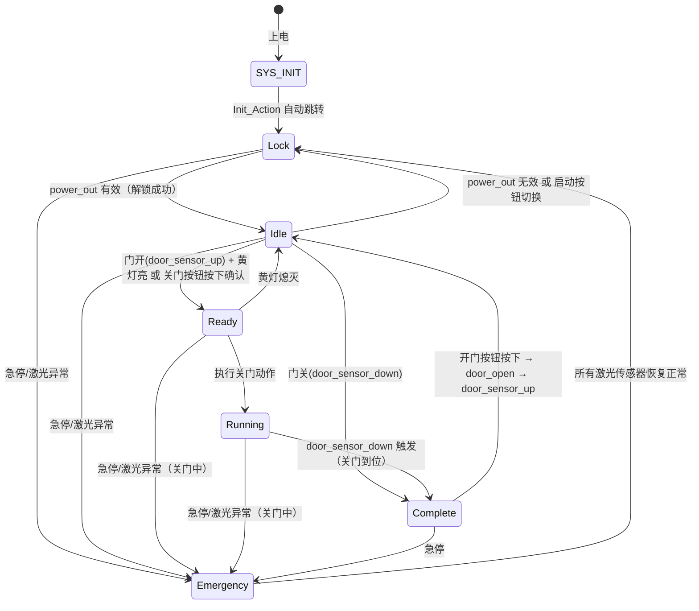

# StateMachine 状态机分析与优化方案

## 一、概述

当前状态机实现位于 [`Hardware/BsmRelay/Src/StateMachine.c`](../Hardware/BsmRelay/Src/StateMachine.c) 和 [`Hardware/BsmRelay/Inc/StateMachine.h`](../Hardware/BsmRelay/Inc/StateMachine.h)。系统以 50ms 周期（见 [`Core/Src/main.c:253`](../Core/Src/main.c:253)）调用 [`StateMachine_Input()`](../Hardware/BsmRelay/Src/StateMachine.c:39) 驱动状态切换。

## 二、状态定义

枚举 [`MachineState`](../Hardware/BsmRelay/Inc/StateMachine.h:8) 定义了 7 个状态：

| 状态 | 值 | 枚举名 | 含义 |
|:---:|:---:|--------|------|
| ⚫ SYS_INIT | 6 | 系统初始化 | 上电后初始状态 |
| 🔒 Lock | 0 | 锁定 | 系统锁定，不可操作 |
| ⚪ Idle | 1 | 空闲 | 解锁但未操作 |
| 🟡 Ready | 2 | 准备 | 门动作准备就绪（黄灯） |
| 🔵 Running | 3 | 运行中 | 关门动作执行中 |
| 🟢 Complete | 5 | 完成 | 关门完成 |
| 🔴 Emergency | 4 | 紧急 | 急停或传感器异常 |

> ⚠️ **注意**：`Running` 状态的注释写的是 `Machine Hardware Error`，与实际含义（关门运动中）不符。

## 三、状态切换图



### 详细切换条件

#### SYS_INIT → Lock
无条件自动切换（`Init_Action` 直接设置 `system_status = Lock`）。

#### Lock → Idle
- `out_01_08 & power_out` 有效 → 解锁成功

#### Idle → Lock
- `!(out_01_08 & power_out)` → 解锁使能关闭
- 启动按钮按下确认后切换（`Lock_Action` 中的按钮切换逻辑）

#### Idle → Ready
- 门已开 (`door_sensor_up`) **且** 黄灯亮 (`led_yellow`)
- **或** 关门按钮按下达到 `Door_Delay_num` 次且按钮已释放

#### Idle → Complete
- 门已关 (`door_sensor_down`)

#### Ready → Idle
- `!(out_01_08 & led_yellow)` → 黄灯熄灭

#### Ready → Running
- 黄灯亮起，执行关门动作 (`door_close`) **且** 门还未完全关闭
- **或** 两个关门按钮同时按下且准备就绪

#### Running → Complete
- 气缸回缩 (`door_close`) **且** 触发后限位传感器 (`door_sensor_down`)

#### Complete → Idle
- 气缸伸出 (`door_open`) **且** 触发前限位传感器 (`door_sensor_up`)
- 开门按钮按下确认后执行开门动作

#### 任何状态 → Emergency
- **急停按钮**按下：`(in_09_16 & (stop_button>>8)) != 0x08`
- **激光传感器**异常触发（关门过程中且计时 > 默认时间 * 2/3）

#### Emergency → Lock
- 所有激光传感器恢复正常

## 四、当前实现分析

### 4.1 架构模式

当前使用"轮询调用 + 分支判断"模式：

```c
// StateMachine_Input() 中依次调用所有 Action
Init_Action(...);
Lock_Action(...);
Idle_Action(...);
// ... 所有状态
Release_detection(...);
Door_detection(...);
```

每个 `Xxx_Action` 内部用 `if(system_status == Xxx)` 判断当前状态。

### 4.2 代码问题清单

#### 🔴 严重问题

| # | 问题 | 影响 |
|---|------|------|
| 1 | `system_status` 声明为 `uint8_t` 而非 `MachineState` 类型 | 类型不安全，可赋任意整数值 |
| 2 | 枚举值顺序混乱——`Lock=0, Idle=1, Ready=2, Running=3, Emergency=4, Complete=5, SYS_INIT=6`，Complete(5) 在 Emergency(4) 之后 | 逻辑顺序与执行流程不一致 |
| 3 | `Running` 注释错误为 `Machine Hardware Error` | 误导维护人员 |

#### 🟡 设计问题

| # | 问题 | 说明 |
|---|------|------|
| 4 | 所有 Action 函数每次周期都无条件调用，内部用 if 判断状态 | 每次调用 9 个函数，实际只有 1-2 个执行有效逻辑，CPU 浪费 |
| 5 | 函数签名冗余——每个 Action 都接收 `in_01_08, in_09_16, out_01_08, out_09_16` | 代码重复、耦合 |
| 6 | 状态进入/驻留/退出动作未分离 | 初始化动作和持续轮询动作混在一起 |
| 7 | 全局变量散落——`lock_num, door_ready_num, door_open_num` 等散布在文件顶部 | 不易维护，状态相关数据应封装 |
| 8 | 所有 Action 函数返回值 `uint8_t` 但从未使用 | 可改为 `void` |
| 9 | `InputIO_Read` / `OutputIO_Read` 返回局部变量指针（`uint8_t data[2]`） | UB（未定义行为），可能导致数据错乱 |

#### 🟢 可优化项

| # | 问题 | 说明 |
|---|------|------|
| 10 | 状态转换条件散落在不同函数中 | 集中管理更清晰 |
| 11 | 无状态转换表/矩阵 | 添加后便于可视化 |
| 12 | 按钮防抖逻辑用计数 + 延时硬编码 | 可抽离为通用模块 |
| 13 | `Debug` 宏定义冲突风险（过于通用） | 建议改为 `STATEMACHINE_DEBUG` |

## 五、优化方案

### 5.1 推荐方案：函数指针表 + 状态结构体

采用经典的状态机模式，核心结构如下：

```c
typedef struct {
    MachineState state;            // 状态枚举值
    void (*enter)(void);           // 进入状态时调用一次
    void (*action)(IOStatus* io);  // 状态驻留时周期性调用
    void (*exit)(void);            // 退出状态时调用一次
    MachineState next_state;       // 默认下一状态
} StateHandler;
```

核心改进点：

1. **函数指针表**代替 `if-else` 链——O(1) 查找
2. **状态动作分离**——`enter/action/exit` 清晰分离
3. **类型安全**——`system_status` 使用 `MachineState` 枚举类型
4. **IO 读取一次**——避免重复读取
5. **状态数据封装**——每个状态的自有数据局部化

### 5.2 优化效果对比

| 指标 | 当前实现 | 优化后 |
|:----|:--------|:------|
| 状态查找 | O(n) 遍历 9 个函数 | O(1) 直接索引 |
| 代码耦合 | IO 读取分散 | 统一读取传入 |
| 类型安全 | `uint8_t` 裸变量 | `MachineState` 枚举 |
| 可扩展性 | 新增状态需修改多处 | 仅添加表项 |
| 可维护性 | 逻辑散落 | 状态逻辑内聚 |

### 5.3 改进点清单

1. ✅ 使用 `MachineState` 枚举类型代替 `uint8_t`
2. ✅ 函数指针状态表（Switch Table）
3. ✅ 状态驻留/进入动作分离
4. ✅ 统一 IO 读取，消除重复
5. ✅ 修复 `Running` 注释
6. ✅ 状态转换集中管理
7. ✅ 消除未使用的返回值
8. ✅ 修复局部变量指针返回的 UB

---

*文档版本: v1.0*
*日期: 2026-05-09*
