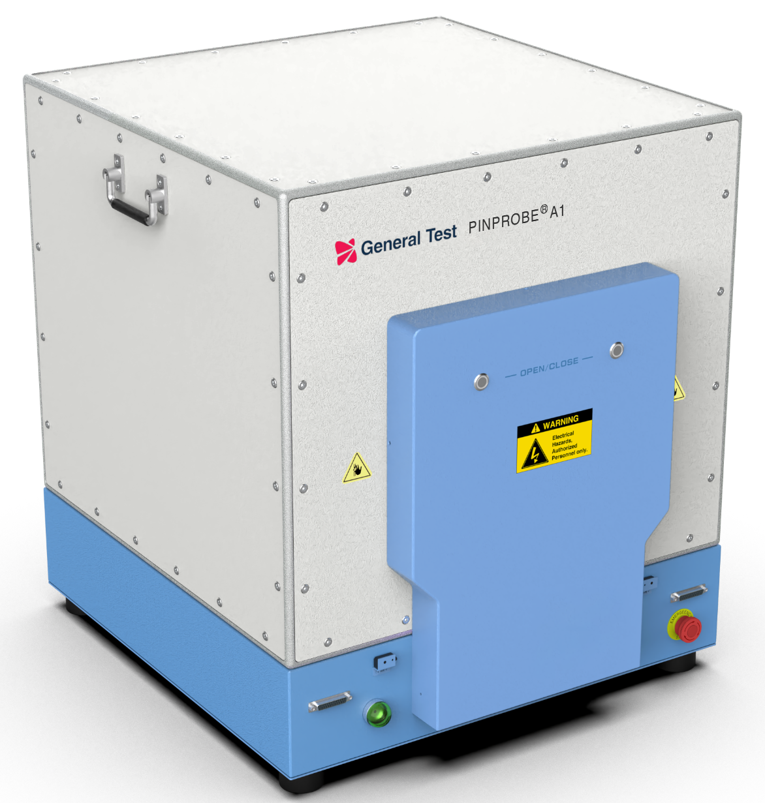

# PinProbe A1下位机 指令说明

## 标准控制指令

| 指令    | 参数 | 说明         |
| ------- | ---- | ------------ |
| `*IDN?` |      | 查询链路箱ID |
| `*WAI`  |      | 等待指令完成 |
| `*OPC?` |      | 查询指令完成 |

## 链路控制指令

| 指令                          | 参数                          | 说明         |
| ----------------------------- | ----------------------------- | ------------ |
| `CONFigure:CYLInder# <value>` | [参数说明](#链路控制参数说明) | 单独控制气缸 |
| `CONFigure:LOCK <value>`     | [参数说明](#链路控制参数说明) | 单独控制锁定 |
| `CONFigure:LED <value>`      | [参数说明](#链路控制参数说明) | 单独控制LED  |
| `READ:CYLInder#:STATe?`       | [返回值](#链路控制参数说明)   | 单独控制开关 |
| `READ:LOCK:STATe?`           | [返回值](#链路控制参数说明)   | 单独控制开关 |
| `READ:LED:STATe?`            | [返回值](#链路控制参数说明)   | 单独控制开关 |
| `READ:SYSTEM:STATe?`          | [返回值](#链路控制参数说明)   | 单独控制开关 |

### 可选气缸配置

- `OPEN`
  - 气缸处于打开状态
- `CLOSE`
  - 气缸处于关闭状态

### Example

- `CONFigure:CYLInder1 OPEN`

### 气缸状态显示

- `OPENING`
  - 气缸处于伸出过程中
- `OPENED`
  - 气缸处于打开状态
- `CLOSING`
  - 气缸收缩过程中
- `CLOSED`
  - 气缸处于关闭状态

### Example

- `READ:CYLInder1:STATE?`

### 可选LED灯状态

- `GREEN`
  - LED指示灯处于绿色
- `READ`
  - LED指示灯处于红色
- `YELLOW`
  - LED指示灯处于黄色
- `OFF`
  - LED指示灯处于关闭状态

### Example

`CONFigure:LED OFF`
`READ:LED:STATE?`

### 可选锁定状态

- `UNLOCK`
  - 设备处于锁定状态
- `LOCKED`
  - 设备处于解锁状态

### Example

`CONFigure:LOCK UNLOCK`
`READ:LOCK:STATE?`

### 系统流转状态

- `IDLE`
  - 系统处于空闲状态。
- `READY`
  - 系统处于准备运行状态。
- `RUNNING`
  - 系统处于运行中。
- `LOCK`
  - 系统处于锁定状态，需要手动解锁。
- `EMERGENCY`
  - 系统光栅触发、气压传感器触发或者急停被按下。
- `COMPLETE`
  - 系统处于运动完成的可测试状态
  